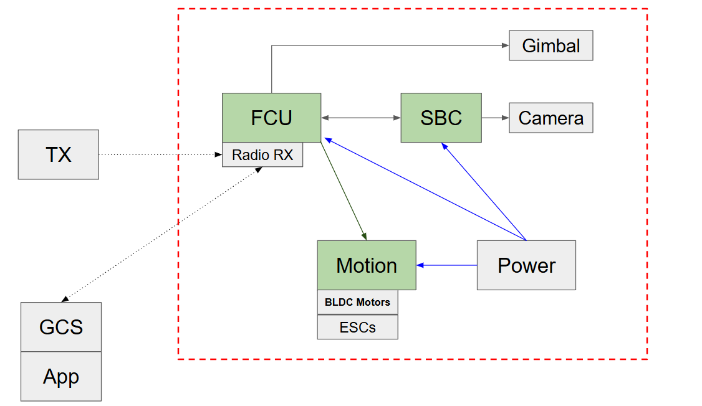
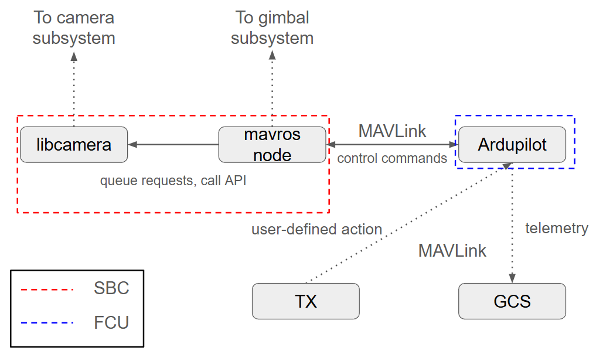
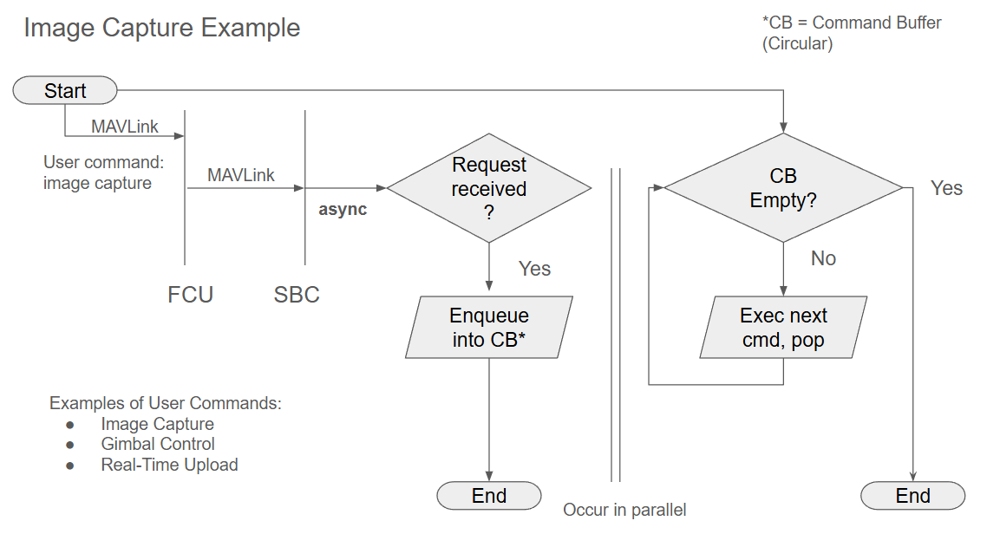

## Embedded Design
Block diagrams and image capture flowchart for the embedded software design can be found at
[FYDP - Embedded Design, Drone Systems](https://docs.google.com/presentation/d/17k1I2zMo0NZMISUKjszZMWU5g44HDWig1tOEQQhF7TI/edit#slide=id.g311a7c1ce05_0_4). They are repeated below for convenience.

### System Block Diagram

</img>

### Software Modules - High-Level Block Diagram

</img>

### Image Capture Flowchart

</img>

### Notes
* Semi-autonomous, single pilot
    * Semi-autonomous gimbal control to enable pilot to focus on flying
    * GCS for real-time monitoring if present
    * Should be able to perform body + camera control via transmitter (mapping, require compatible controller using OpenTX)
* Circular Buffer may not be necessary, as ROS2’s internal queuing / async services and action servers / message queues could handle incoming requests without additional buffering

